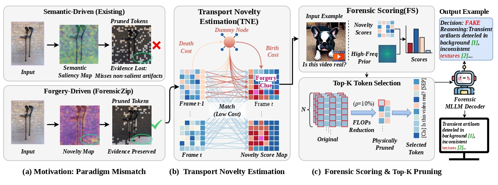

# ForensicZip: More Tokens are Better but Not Necessary in Forensic Vision-Language Models

Yingxin Lai, [Zitong Yu](https://scholar.google.com/citations?hl=en&user=ziHejLwAAAAJ&view_op=list_works&sortby=pubdate), Jun Wang, Linlin Shen, Yong Xu, and Xiaochun Cao

**Code:** https://github.com/laiyingxin2/ForensicZip  
**Model:** https://huggingface.co/lingcco/fakeVLM  
**Dataset:** https://huggingface.co/datasets/lingcco/FakeClue/

## Overview

Multimodal Large Language Models (MLLMs) enable interpretable multimedia forensics by generating textual rationales for forgery detection. However, processing dense visual sequences is computationally expensive, especially for high-resolution images and videos. Existing visual token pruning methods are largely semantic-driven: they preserve salient objects while often discarding background regions where manipulation traces such as high-frequency anomalies and temporal jitters reside.

ForensicZip addresses this limitation from a forgery-driven perspective. It is a training-free framework that formulates temporal token evolution as a Birth-Death Optimal Transport problem with a slack dummy node, allowing transient generative artifacts to be measured as physical discontinuities. The resulting forensic score combines transport-based novelty with high-frequency priors, so that forensic evidence can be preserved even under large-ratio compression.

On deepfake and AIGC benchmarks, ForensicZip achieves strong detection performance at aggressive compression ratios, reaching 2.97× speedup and more than 90% FLOPs reduction at 10% token retention while maintaining state-of-the-art accuracy.

<p align="center">
  
</p>

See `docs/data_preparation.md` for the expected local file layout.

## Repository Structure

- `forensiczip/` — method implementation and utility functions
- `fakevlm/` — FakeVLM-compatible skeleton modules
- `scripts/` — evaluation entrypoints
- `docs/` — running and data preparation notes
- `imgs/` — method figures

## Installation

```bash
conda create -n forensiczip python=3.10 -y
conda activate forensiczip
pip install -r requirements.txt
```

If you already have a compatible environment, you can reuse it directly.

## Quick Start

### FakeClue

```bash
MODEL_PATH_7B=<MODEL_PATH> \
FAKECLUE_TEST_JSON=<FAKECLUE_JSON> \
FAKECLUE_DATA_BASE=<FAKECLUE_MEDIA_DIR> \
CUDA_DEVICES=0 \
PYTHON_BIN=python \
bash scripts/eval_forensiczip_fakeclue.sh
```

### LOKI

```bash
MODEL_PATH_7B=<MODEL_PATH> \
LOKI_JSON_DIR=<LOKI_JSON_DIR> \
LOKI_MEDIA_ROOT=<LOKI_MEDIA_ROOT> \
CUDA_DEVICES=0 \
PYTHON_BIN=python \
bash scripts/eval_forensiczip_loki.sh
```

## Main Files

- `forensiczip/forensiczip_hf.py` — core method patch
- `forensiczip/loki_utils.py` — LOKI data helpers
- `scripts/eval_forensiczip.py` — evaluation entrypoint
- `scripts/eval_forensiczip_fakeclue.sh` — FakeClue launcher
- `scripts/eval_forensiczip_loki.sh` — LOKI launcher

## Additional Documentation

- `docs/running.md`
- `docs/data_preparation.md`
# ForensicZip: More Tokens are Better but Not Necessary in Forensic Vision-Language Models

Yingxin Lai, [Zitong Yu](https://scholar.google.com/citations?hl=en&user=ziHejLwAAAAJ&view_op=list_works&sortby=pubdate), Jun Wang, Linlin Shen, Yong Xu, and Xiaochun Cao

**Code:** https://github.com/laiyingxin2/ForensicZip  
**Model:** https://huggingface.co/lingcco/fakeVLM  
**Dataset:** https://huggingface.co/datasets/lingcco/FakeClue/

## Overview

Multimodal Large Language Models (MLLMs) enable interpretable multimedia forensics by generating textual rationales for forgery detection. However, processing dense visual sequences is computationally expensive, especially for high-resolution images and videos. Existing visual token pruning methods are largely semantic-driven: they preserve salient objects while often discarding background regions where manipulation traces such as high-frequency anomalies and temporal jitters reside.

ForensicZip addresses this limitation from a forgery-driven perspective. It is a training-free framework that formulates temporal token evolution as a Birth-Death Optimal Transport problem with a slack dummy node, allowing transient generative artifacts to be measured as physical discontinuities. The resulting forensic score combines transport-based novelty with high-frequency priors, so that forensic evidence can be preserved even under large-ratio compression.

On deepfake and AIGC benchmarks, ForensicZip achieves strong detection performance at aggressive compression ratios, reaching 2.97× speedup and more than 90% FLOPs reduction at 10% token retention while maintaining state-of-the-art accuracy.

<p align="center">
  
</p>

See `docs/data_preparation.md` for the expected local file layout.

## Repository Structure

- `forensiczip/` — method implementation and utility functions
- `fakevlm/` — FakeVLM-compatible skeleton modules
- `scripts/` — evaluation entrypoints
- `docs/` — running and data preparation notes
- `imgs/` — method figures

## Installation

```bash
conda create -n forensiczip python=3.10 -y
conda activate forensiczip
pip install -r requirements.txt
```

If you already have a compatible environment, you can reuse it directly.

## Quick Start

### FakeClue

```bash
MODEL_PATH_7B=<MODEL_PATH> \
FAKECLUE_TEST_JSON=<FAKECLUE_JSON> \
FAKECLUE_DATA_BASE=<FAKECLUE_MEDIA_DIR> \
CUDA_DEVICES=0 \
PYTHON_BIN=python \
bash scripts/eval_forensiczip_fakeclue.sh
```

### LOKI

```bash
MODEL_PATH_7B=<MODEL_PATH> \
LOKI_JSON_DIR=<LOKI_JSON_DIR> \
LOKI_MEDIA_ROOT=<LOKI_MEDIA_ROOT> \
CUDA_DEVICES=0 \
PYTHON_BIN=python \
bash scripts/eval_forensiczip_loki.sh
```

## Main Files

- `forensiczip/forensiczip_hf.py` — core method patch
- `forensiczip/loki_utils.py` — LOKI data helpers
- `scripts/eval_forensiczip.py` — evaluation entrypoint
- `scripts/eval_forensiczip_fakeclue.sh` — FakeClue launcher
- `scripts/eval_forensiczip_loki.sh` — LOKI launcher

## Additional Documentation

- `docs/running.md`
- `docs/data_preparation.md`
